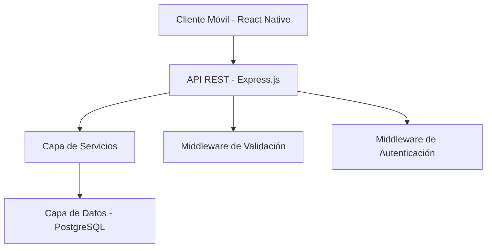
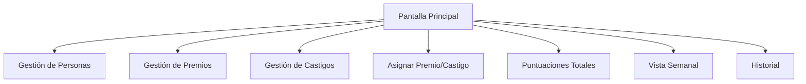

# Documento de Diseño - Sistema de Premios y Castigos

## Visión General

El sistema será una aplicación móvil multiplataforma con arquitectura cliente-servidor. El frontend será desarrollado en React Native para compatibilidad iOS/Android, mientras que el backend utilizará Node.js con Express y una base de datos PostgreSQL para garantizar integridad de datos y escalabilidad.

## Arquitectura

### Arquitectura General



### Patrón de Arquitectura

- **Frontend**: Arquitectura basada en componentes con Redux para gestión de estado
- **Backend**: Arquitectura en capas (Controller → Service → Repository → Database)
- **Comunicación**: API REST con formato JSON
- **Base de Datos**: Modelo relacional normalizado

## Componentes e Interfaces

### Frontend - React Native

#### Componentes Principales

1. **NavigationContainer**: Navegación principal de la aplicación
2. **PersonManagement**: Gestión CRUD de personas
3. **RewardManagement**: Gestión CRUD de premios
4. **PunishmentManagement**: Gestión CRUD de castigos
5. **AssignmentInterface**: Interfaz para asignar premios/castigos
6. **ScoreboardView**: Vista de puntuaciones totales y ranking
7. **WeeklyView**: Vista semanal de puntuaciones
8. **AssignmentHistory**: Historial de asignaciones

#### Estructura de Navegación



#### Gestión de Estado (Redux)

- **personSlice**: Estado de personas registradas
- **rewardSlice**: Estado de premios disponibles
- **punishmentSlice**: Estado de castigos disponibles
- **assignmentSlice**: Estado de asignaciones y puntuaciones
- **uiSlice**: Estado de la interfaz (loading, errores, etc.)

### Backend - Node.js/Express

#### Controladores

1. **PersonController**: Endpoints para CRUD de personas
2. **RewardController**: Endpoints para CRUD de premios
3. **PunishmentController**: Endpoints para CRUD de castigos
4. **AssignmentController**: Endpoints para asignaciones y puntuaciones

#### Servicios

1. **PersonService**: Lógica de negocio para personas
2. **RewardService**: Lógica de negocio para premios
3. **PunishmentService**: Lógica de negocio para castigos
4. **AssignmentService**: Lógica de negocio para asignaciones
5. **ScoreCalculationService**: Cálculo de puntuaciones totales y semanales

#### Repositorios

1. **PersonRepository**: Acceso a datos de personas
2. **RewardRepository**: Acceso a datos de premios
3. **PunishmentRepository**: Acceso a datos de castigos
4. **AssignmentRepository**: Acceso a datos de asignaciones

### API REST Endpoints

```
GET    /api/persons                 # Listar personas
POST   /api/persons                 # Crear persona
PUT    /api/persons/:id             # Actualizar persona
DELETE /api/persons/:id             # Eliminar persona

GET    /api/rewards                 # Listar premios
POST   /api/rewards                 # Crear premio
PUT    /api/rewards/:id             # Actualizar premio
DELETE /api/rewards/:id             # Eliminar premio

GET    /api/punishments             # Listar castigos
POST   /api/punishments             # Crear castigo
PUT    /api/punishments/:id         # Actualizar castigo
DELETE /api/punishments/:id         # Eliminar castigo

GET    /api/assignments             # Listar asignaciones
POST   /api/assignments             # Crear asignación
DELETE /api/assignments/:id         # Eliminar asignación

GET    /api/scores/total            # Puntuaciones totales
GET    /api/scores/weekly           # Puntuaciones semanales
GET    /api/scores/person/:id       # Puntuación de persona específica
```

## Modelos de Datos

### Esquema de Base de Datos

```sql
-- Tabla de Personas
CREATE TABLE persons (
    id SERIAL PRIMARY KEY,
    name VARCHAR(100) NOT NULL UNIQUE,
    created_at TIMESTAMP DEFAULT CURRENT_TIMESTAMP,
    updated_at TIMESTAMP DEFAULT CURRENT_TIMESTAMP
);

-- Tabla de Premios
CREATE TABLE rewards (
    id SERIAL PRIMARY KEY,
    name VARCHAR(100) NOT NULL,
    value INTEGER NOT NULL CHECK (value > 0),
    created_at TIMESTAMP DEFAULT CURRENT_TIMESTAMP,
    updated_at TIMESTAMP DEFAULT CURRENT_TIMESTAMP
);

-- Tabla de Castigos
CREATE TABLE punishments (
    id SERIAL PRIMARY KEY,
    name VARCHAR(100) NOT NULL,
    value INTEGER NOT NULL CHECK (value < 0),
    created_at TIMESTAMP DEFAULT CURRENT_TIMESTAMP,
    updated_at TIMESTAMP DEFAULT CURRENT_TIMESTAMP
);

-- Tabla de Asignaciones
CREATE TABLE assignments (
    id SERIAL PRIMARY KEY,
    person_id INTEGER NOT NULL REFERENCES persons(id) ON DELETE CASCADE,
    item_type VARCHAR(20) NOT NULL CHECK (item_type IN ('reward', 'punishment')),
    item_id INTEGER NOT NULL,
    item_name VARCHAR(100) NOT NULL,
    item_value INTEGER NOT NULL,
    assigned_at TIMESTAMP DEFAULT CURRENT_TIMESTAMP
);

-- Índices para optimización
CREATE INDEX idx_assignments_person_id ON assignments(person_id);
CREATE INDEX idx_assignments_assigned_at ON assignments(assigned_at);
CREATE INDEX idx_assignments_person_date ON assignments(person_id, assigned_at);
```

### Modelos de Datos (TypeScript)

```typescript
interface Person {
  id: number;
  name: string;
  createdAt: Date;
  updatedAt: Date;
}

interface Reward {
  id: number;
  name: string;
  value: number; // Siempre positivo
  createdAt: Date;
  updatedAt: Date;
}

interface Punishment {
  id: number;
  name: string;
  value: number; // Siempre negativo
  createdAt: Date;
  updatedAt: Date;
}

interface Assignment {
  id: number;
  personId: number;
  itemType: 'reward' | 'punishment';
  itemId: number;
  itemName: string;
  itemValue: number;
  assignedAt: Date;
}

interface PersonScore {
  personId: number;
  personName: string;
  totalScore: number;
  weeklyScore: number;
  assignmentCount: number;
}
```

## Manejo de Errores

### Frontend

1. **Validación de Formularios**: Validación en tiempo real con mensajes de error claros
2. **Manejo de Errores de Red**: Retry automático y mensajes informativos
3. **Estados de Carga**: Indicadores visuales durante operaciones asíncronas
4. **Fallbacks**: Datos en caché cuando no hay conexión

### Backend

1. **Validación de Entrada**: Middleware de validación con Joi o similar
2. **Manejo de Errores de Base de Datos**: Transacciones y rollback automático
3. **Logging**: Sistema de logs estructurado con Winston
4. **Respuestas de Error Consistentes**: Formato JSON estándar para errores

```typescript
interface ErrorResponse {
  success: false;
  error: {
    code: string;
    message: string;
    details?: any;
  };
}
```

## Estrategia de Testing

### Frontend Testing

1. **Unit Tests**: Jest + React Native Testing Library
   - Componentes individuales
   - Reducers de Redux
   - Utilidades y helpers

2. **Integration Tests**: 
   - Flujos completos de usuario
   - Integración con API

3. **E2E Tests**: Detox
   - Casos de uso principales
   - Navegación entre pantallas

### Backend Testing

1. **Unit Tests**: Jest
   - Servicios de negocio
   - Repositorios
   - Utilidades

2. **Integration Tests**:
   - Endpoints de API
   - Integración con base de datos

3. **API Tests**: Supertest
   - Validación de contratos de API
   - Casos de error

### Casos de Prueba Críticos

1. **Cálculo de Puntuaciones**: Verificar suma correcta de premios y castigos
2. **Filtrado Semanal**: Validar que solo se incluyan asignaciones de la semana actual
3. **Asignaciones Múltiples**: Confirmar que un premio/castigo se puede asignar a múltiples personas
4. **Integridad de Datos**: Verificar que las eliminaciones no dejen datos huérfanos
5. **Validaciones**: Confirmar que los premios son positivos y los castigos negativos

## Consideraciones de Rendimiento

### Frontend

1. **Lazy Loading**: Carga diferida de pantallas no críticas
2. **Memoización**: React.memo para componentes que no cambian frecuentemente
3. **Optimización de Listas**: FlatList con keyExtractor optimizado
4. **Caché Local**: AsyncStorage para datos frecuentemente accedidos

### Backend

1. **Índices de Base de Datos**: Optimización de consultas frecuentes
2. **Paginación**: Limitar resultados en listas grandes
3. **Caché de Consultas**: Redis para puntuaciones calculadas
4. **Conexión Pool**: Gestión eficiente de conexiones a base de datos

### Cálculo de Puntuaciones

```sql
-- Query optimizada para puntuación total
SELECT 
    p.id,
    p.name,
    COALESCE(SUM(a.item_value), 0) as total_score
FROM persons p
LEFT JOIN assignments a ON p.id = a.person_id
GROUP BY p.id, p.name
ORDER BY total_score DESC;

-- Query optimizada para puntuación semanal
SELECT 
    p.id,
    p.name,
    COALESCE(SUM(a.item_value), 0) as weekly_score
FROM persons p
LEFT JOIN assignments a ON p.id = a.person_id 
    AND a.assigned_at >= date_trunc('week', CURRENT_DATE)
    AND a.assigned_at < date_trunc('week', CURRENT_DATE) + INTERVAL '1 week'
GROUP BY p.id, p.name
ORDER BY weekly_score DESC;
```